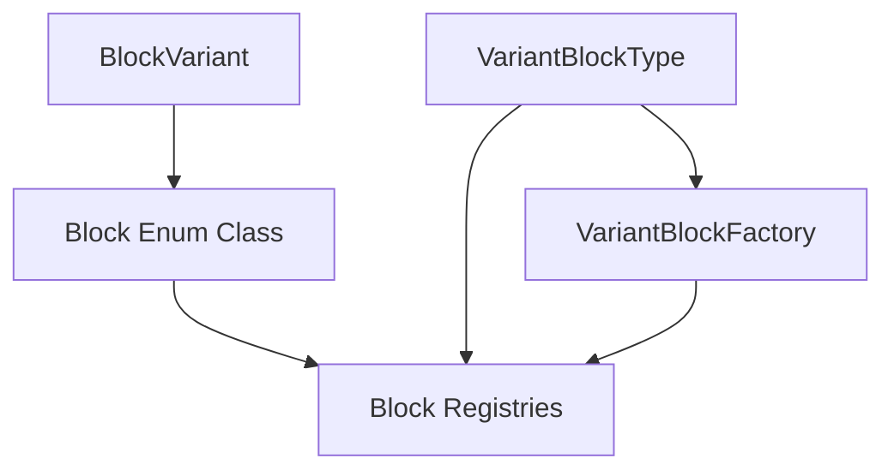

# Block Variant and Adapter API

[**Chinese**](/docs/i18n/zh_cn/gtlite-block-adapter-api.md) | [**English**](/docs/gtlite-block-adapter-api.md)

```mermaid
graph TD
  A[BlockVariant] --> B[Block Enum Class]
  B[Block Enum Class] --> E[Block Registries]
  
  C[VariantBlockType] --> D[VariantBlockFactory] 
  
  C[VariantBlockType] --> E[Block Registries]
  D[VariantBlockFactory]  --> E[Block Registries]
```