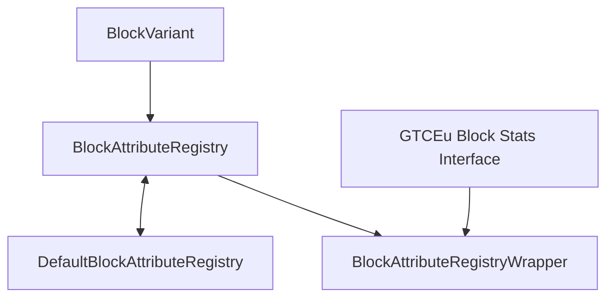

# Block Attribute API

[**Chinese**](/docs/i18n/zh_cn/gtlite-block-attribute-api.md) | [**English**](/docs/gtlite-block-attribute-api.md)

```mermaid
graph TD
  A[BlockVariant] --> B[BlockAttributeRegistry] <--> C[DefaultBlockAttributeRegistry]
  
  A1[GTCEu Block Stats Interface] --> B1[BlockAttributeRegistryWrapper]

  B[BlockAttributeRegistry] --> B1[BlockAttributeRegistryWrapper]
```