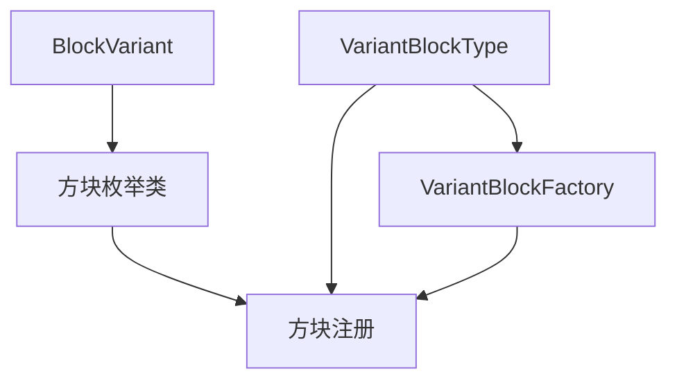

# 方块变种与适配器

[**中文**](/docs/i18n/zh_cn/gtlite-block-adapter-api.md) | [**英文**](/docs/gtlite-block-adapter-api.md)

```mermaid
graph TD
  A[BlockVariant] --> B[方块枚举类]
  B[方块枚举类] --> E[方块注册]
  
  C[VariantBlockType] --> D[VariantBlockFactory] 
  
  C[VariantBlockType] --> E[方块注册]
  D[VariantBlockFactory]  --> E[方块注册]
```